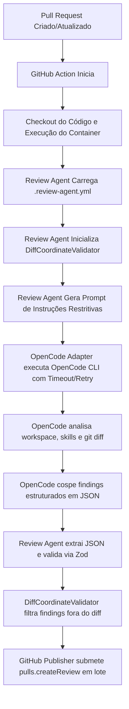

# Review Agent 🤖

### Plataforma de Code Review Inteligente Baseada em Skills e OpenCode

O **Review Agent** é uma ferramenta universal para revisão automática de código em Pull Requests (PRs). Ele atua como um **orquestrador leve** que integra o ambiente de CI/CD (GitHub Actions) com a engine local de IA **OpenCode**.

Toda a inteligência de revisão, análise de contexto e regras são definidas através de **Skills** nativas do OpenCode (arquivos Markdown na pasta `.opencode/skills/<nome>/SKILL.md` com YAML frontmatter) e configuradas por um arquivo YAML na raiz do seu projeto.

---

## 🚀 Filosofia de Design e Decisões Arquiteturais

Na versão 2.0, o Review Agent passou por uma profunda simplificação técnica com foco em robustez, manutenibilidade e delegação inteligente.

### 1. O OpenCode é o Revisor

A IA do **OpenCode** possui acesso completo ao workspace do projeto durante a execução. Ela é capaz de rodar `git diff`, abrir arquivos adicionais para entender dependências, imports, documentações e testes. Portanto, o Review Agent **não possui analisadores de código, detectores de linguagem ou analisadores de diff**. Toda a inteligência de revisão pertence ao OpenCode.

### 2. Validação Híbrida de Coordenadas (Ajuste Técnico Importante)

Para evitar falhas na API do GitHub ao tentar criar comentários inline em linhas não modificadas ou inexistentes, o Review Agent inclui o componente `DiffCoordinateValidator`. Ele obtém as linhas adicionadas ou de contexto modificadas no diff:

- Primeiro tenta consultar o **Git local** (altamente eficiente e independente de rede).
- Caso falhe (por exemplo, devido a um checkout raso/shallow clone em CI), faz uma requisição de fallback à **API do GitHub** (`pulls.listFiles`).
- Qualquer achado da IA em linhas fora do diff é omitido dos comentários inline, mas mantido no sumário Markdown consolidado do PR.

### 3. Estatísticas Calculadas no Wrapper

Embora o OpenCode possa tentar gerar estatísticas de ocorrências por severidade, as IAs podem falhar em contas simples. O Review Agent calcula localmente a contagem de ocorrências por severidade (`critical`, `high`, `medium`, `low`, `info`) a partir da lista de findings, garantindo consistência estatística de 100% no relatório final.

### 4. Transação Única com `createReview`

Em vez de disparar dezenas de requisições de comentários individuais (que podem causar bloqueios de rate limit e flood de e-mails/notificações para o desenvolvedor), o publicador agrupa o resumo Markdown e todos os comentários inline validados em uma única submissão atômica usando a API `pulls.createReview`.

---

## 🗺️ Fluxo de Execução Simplificado



---

## 📁 Estrutura de Diretórios do Projeto

```text
review-agent/
├── src/
│   ├── cli/
│   │   └── index.ts          # CLI com Commander (comandos run, init)
│   ├── core/
│   │   ├── config.ts         # Leitor e validador do arquivo .review-agent.yml
│   │   ├── diff-validator.ts # Validador híbrido de coordenadas do diff (Git + GitHub API)
│   │   ├── prompt.ts         # Gerador de prompt/instruções para o OpenCode
│   │   └── engine.ts         # Coordenador de fluxo (Orquestrador) do Review Agent
│   ├── github/
│   │   └── publisher.ts      # Formatador de Markdown e publicador via API do GitHub
│   ├── models/
│   │   └── types.ts          # Interfaces TypeScript de Findings e ReviewResult
│   └── opencode/
│       └── adapter.ts        # Invocação da CLI do OpenCode com timeout, retry e parser JSON
├── tests/
│   ├── config.test.ts        # Testes de carga de configurações YAML
│   ├── diff-validator.test.ts # Testes de parse do diff e validação de linhas
│   ├── adapter.test.ts       # Testes de retry, timeout e parser de JSON do OpenCode
│   ├── findings.test.ts      # Testes de conformidade do schema Zod de findings
│   └── publisher.test.ts     # Testes de Markdown e cálculo do summary local
├── Dockerfile                # Imagem docker de distribuição (multi-stage)
├── package.json              # Scripts npm e dependências
└── tsconfig.json             # Configuração do TypeScript (ES2022/NodeNext)
```

---

## ⚙️ Arquivo de Configuração `.review-agent.yml`

O orquestrador criará automaticamente o arquivo de configuração `.review-agent.yml` na raiz do seu projeto caso ele não exista. Você só precisa criá-lo ou alterá-lo se quiser sobrescrever os valores padrão. Exemplo completo:

```yaml
version: 1

review:
  max_findings: 20 # Limite máximo de ocorrências a reportar no PR
  timeoutSeconds: 300 # Tempo limite (em segundos) de execução por tentativa da IA
  maxRetries: 3 # Tentativas automáticas em caso de falha ou timeout do OpenCode

output:
  mode:
    both # Modos aceitos:
    # - 'summary': publica apenas o comentário de resumo geral
    # - 'inline': publica apenas comentários nas linhas afetadas
    # - 'both': publica o resumo e os comentários inline juntos
```

---

## 🛠️ Comandos de Desenvolvimento e Teste

### Instalar Dependências e Compilar

```bash
npm install
npm run build
```

### Executar Testes Unitários (Vitest)

```bash
npm run test
```

---

## 📖 Como Funciona a Execução e Como Configurar no Seu Projeto

### ❓ O Review Agent é uma GitHub Action?

**Sim!** O Review Agent foi projetado para rodar de forma nativa e automática como uma **GitHub Action** (empacotada em uma imagem Docker publicada no GitHub Container Registry - GHCR).

Quando um desenvolvedor abre ou atualiza um Pull Request no seu repositório alvo:

1. O GitHub Actions inicia um workflow.
2. Faz o checkout do código.
3. Invoca o contêiner do **Review Agent** passando o diretório do projeto como volume (`-v $PWD:/workspace`).
4. O Review Agent lê as configurações e regras de dentro do próprio repositório, roda a IA do OpenCode localmente e publica os comentários diretamente no PR.

---

## 🛠️ Como Configurar em Qualquer Repositório Alvo

Para ativar o Review Agent no seu repositório (FastAPI, React, Spring, etc.), siga os dois passos simples abaixo:

### Passo 1: Inicialização Automática da Estrutura

Você pode usar a própria imagem Docker oficial para criar automaticamente a árvore de arquivos e diretórios de Skills padrão no seu workspace atual:

```bash
docker run --rm -v $PWD:/workspace ghcr.io/seu-usuario/review-agent:latest init
```

Esse comando criará o arquivo `.review-agent.yml` (opcional) e as pastas de exemplo sob `.opencode/skills/` contendo os templates para você customizar com as regras de negócio e stack tecnológica do seu repositório.

### Passo 2: Criar o arquivo do workflow do GitHub Actions

Crie o arquivo `.github/workflows/review-agent.yml` no seu repositório apontando para a nossa action:

```yaml
name: Review Agent

on:
  pull_request:
    types: [opened, synchronize, reopened]
    
permissions:
  contents: read
  pull-requests: write

jobs:
  review:
    runs-on: ubuntu-latest
    steps:
      - name: Checkout Code
        uses: actions/checkout@v4
        with:
          fetch-depth: 0 # IMPORTANTE: Necessário para carregar o histórico de commits para que o diff funcione

      # Opcional/Recomendado: Se o seu linter de projeto (ex: ESLint) requer pacotes instalados localmente para rodar
      - name: Setup Node.js
        uses: actions/setup-node@v4
        with:
          node-version: 20
          cache: 'npm'
          cache-dependency-path: frontend/package-lock.json # Ajuste para a pasta do seu package.json

      - name: Install Frontend Dependencies
        run: |
          cd frontend # Ajuste para a pasta do seu package.json
          npm ci

      - name: Code Reviewer Agent 🤖
        uses: Digital-Analytics-Apps/ai-code-reviewer@main
        env:
          GITHUB_TOKEN: ${{ secrets.GITHUB_TOKEN }}
          GOOGLE_GENERATIVE_AI_API_KEY: ${{ secrets.GOOGLE_GENERATIVE_AI_API_KEY }}
          OPENAI_API_KEY: ${{ secrets.OPENAI_API_KEY }}
          ANTHROPIC_API_KEY: ${{ secrets.ANTHROPIC_API_KEY }}
          OPENCODE_API_URL: ${{ secrets.OPENCODE_API_URL }}
          OPENCODE_MODEL: ${{ secrets.OPENCODE_MODEL }}
```

> [!IMPORTANT]
> **Nota sobre Dependências de Linters:**
> Caso a IA tente rodar ferramentas como `eslint` localmente no repositório e suas configurações façam imports de pacotes de dependências (como `@eslint/js`), certifique-se de configurar e instalar os módulos no runner (ex: `npm ci`) antes da execução do agente. O workspace é mapeado por completo para dentro do contêiner Docker do agente, garantindo que o lint encontre a pasta `node_modules` correspondente.

> [!CAUTION]
> **Aviso de Segurança Importante:**
> Recomendamos usar estritamente o gatilho `pull_request` padrão. **Evite usar o gatilho `pull_request_target`** com o Review Agent em repositórios públicos. Como a IA do OpenCode possui acesso a ferramentas de execução de terminal (`bash` com permissões automáticas), um PR malicioso originado de um fork do repositório poderia injetar arquivos ou prompts customizados nas Skills para instruir a IA a exfiltrar Secrets do repositório principal se o workflow estivesse rodando sob o privilégio elevado de `pull_request_target`.


### Passo 4: Configurar as Variáveis de Ambiente e Segredos (Secrets)

Para que a execução no GitHub Actions (ou localmente) funcione com sucesso, certifique-se de configurar as seguintes chaves de API nos segredos do seu repositório (**Repository Secrets**):

#### 🔑 Segredos Obrigatórios (Modelos de IA)

Configure pelo menos **uma** das chaves abaixo de acordo com o provedor que deseja utilizar na IA do OpenCode:

- `GOOGLE_GENERATIVE_AI_API_KEY`: Chave de API da Google GenAI (Gemini).
- `OPENAI_API_KEY`: Chave de API da OpenAI.
- `ANTHROPIC_API_KEY`: Chave de API da Anthropic (Claude).

#### 🤖 Variáveis Automáticas (Fornecidas pelo GitHub Actions)

As seguintes variáveis já são passadas de forma automática pelo runner do GitHub, portanto você **não** precisa criá-las manualmente em Secrets:

- `GITHUB_TOKEN`: Utilizada para autenticar e criar os comentários e a revisão no pull request.
- `GITHUB_REPOSITORY`: Nome do repositório no formato `owner/repo`.
- `GITHUB_EVENT_PATH`: Caminho dos metadados do evento disparador (PR).

#### ⚙️ Parâmetros Opcionais de Customização

- `OPENCODE_MODEL`: Define explicitamente qual modelo de linguagem o OpenCode deve utilizar (ex: `google/gemini-2.5-flash`, `openai/gpt-4o-mini`, `anthropic/claude-3-5-sonnet-20241022`).
- `OPENCODE_API_URL`: URL base customizada se você estiver conectando a um gateway ou proxy corporativo.

---

### 💻 Executar o Review Agent Localmente (Modo Dry-Run)

Para facilitar a execução local no terminal do seu repositório sem precisar digitar comandos complexos do Docker, o projeto inclui um script auxiliar chamado `run-local.sh`.

#### Passo 1: Crie o arquivo `.env`

Na raiz do seu projeto alvo (onde você quer rodar a revisão), crie um arquivo `.env` contendo a sua chave de API e modelo preferido.

**Exemplo 1: Usando provedores oficiais (Google, OpenAI, Anthropic)**
```env
GOOGLE_GENERATIVE_AI_API_KEY="sua_chave_gemini_aqui"
OPENCODE_MODEL="google/gemini-2.5-flash"
```

**Exemplo 2: Usando uma LLM Customizada (ex: LM Studio, Ollama, vLLM ou Proxy Corporativo)**
Para usar provedores customizados que sigam o padrão da API da OpenAI, basta definir a URL e passar o token genérico na chave `OPENAI_API_KEY`:
```env
OPENCODE_API_URL="http://localhost:1234/v1"
OPENAI_API_KEY="seu_token_aqui_ou_lm_studio"
OPENCODE_MODEL="openai/nome-do-seu-modelo-local"
```

#### Passo 2: Execute o script auxiliar

Aponte para o caminho do `run-local.sh` (que está no repositório do Review Agent) estando dentro da pasta do seu projeto. O script lerá o `.env` automaticamente e repassará tudo para o Docker:

```bash
chmod +x run-local.sh
/caminho/para/review-code-harness/run-local.sh
```

_(Por padrão, se executado sem argumentos, o script roda `run --dry-run --commits 2`)_. Você pode passar outros comandos ou flags livremente:

```bash
# Limitar a análise a 1 commit
/caminho/para/review-code-harness/run-local.sh run --dry-run --commits 1
```

- **O que acontece:** O Review Agent fará a checagem das regras locais contra o seu diff Git local do seu branch atual e imprimirá a tabela de findings estruturados diretamente na tela do seu console, sem realizar chamadas ou posts para as APIs do GitHub.
- **📄 Arquivo de Revisão:** Além de exibir no console, o modo `--dry-run` gera automaticamente um arquivo **`review-summary.md`** na raiz do workspace com o relatório completo formatado em Markdown. Abra esse arquivo no seu editor ou em qualquer previewer de Markdown para uma visualização enriquecida dos achados.

> **Nota:** O arquivo `review-summary.md` já está incluído no `.gitignore` padrão para não poluir seus commits.

#### 🎯 Controle do Escopo do Diff Local (Apenas Dry-Run)

Em execuções locais (`--dry-run`), o orquestrador não possui a API do GitHub para saber exatamente quais arquivos compõem o seu Pull Request. Por padrão, ele tenta adivinhar comparando sua branch local com a `main` (`git diff origin/main...HEAD`). Se a sua branch divergiu muito da main, o diff pode ficar gigantesco e causar estouro de timeout na IA.

Você pode **restringir** o escopo do que a IA vai analisar usando as flags abaixo na CLI:

- `--commits <numero>`: Analisa apenas um número específico de commits recentes.
  - _Exemplo:_ `run --dry-run --commits 3` (avalia apenas os últimos 3 commits da branch atual)
- `--base-branch <branch>`: Analisa contra uma branch de referência diferente da main.
  - _Exemplo:_ `run --dry-run --base-branch develop` (compara `origin/develop...HEAD`)

Você também pode fixar esse comportamento no seu `.review-agent.yml`:

```yaml
review:
  commits: 5              # Analisa apenas os 5 commits mais recentes localmente
  # ou
  commits: all            # Comportamento padrão (analisa o acumulado da branch)
  baseBranch: develop     # Referência para quando commits for "all"
```

> **Aviso:** Essas opções são **ignoradas** durante execuções reais no GitHub Actions, onde o escopo dos arquivos alterados é obtido sempre com 100% de precisão via API do GitHub para o PR específico.

---

## 🛠️ Revisão Híbrida (Linters e Analisadores Estáticos Embutidos)

A imagem Docker oficial do **Review Agent** vem pré-configurada com as principais ferramentas de análise estática de mercado para que a IA possa utilizá-las na revisão:

- **Node.js, React & TypeScript**: `eslint` e `typescript` (disponibilizando o compilador `tsc` para checagem de tipos).
- **Python**: `python3`, `pip3`, `venv`, `ruff` (linter/formatter ultra rápido em Rust) e `uv` (gerenciador de dependências de alto desempenho).

### Como a IA executa os Linters?

Como o OpenCode possui acesso de leitura e execução de comandos Git/Bash locais (com as permissões seguras do sandbox configuradas), a IA pode optar por rodar comandos de validação física como `eslint` ou `ruff check` em arquivos do diff. Isso ajuda a evitar falsos positivos de sintaxe ou tipagem no relatório e permite que ela gere sugestões extremamente precisas baseadas em falhas estáticas reais.

---

## 🧪 Como Testar e Desenvolver Localmente (Para Contribuidores)

Se você estiver desenvolvendo ou testando modificações no próprio orquestrador do **Review Agent**, siga os passos abaixo para simular execuções em modo local.

### 1. Compilar o Projeto

```bash
npm run build
```

### 2. Simular Análise (Modo Dry-Run)

Crie um script mock do OpenCode para simular os findings gerados pela IA sem precisar de uma chave de LLM ativa.

Crie o arquivo `mock-opencode.sh` na pasta de testes:

```bash
#!/bin/bash
echo '{
  "findings": [
    {
      "severity": "critical",
      "file": "src/service.ts",
      "line": 4,
      "title": "Chave Exposta",
      "description": "Hardcoded secret encontrada.",
      "suggestion": "Mova a chave para variáveis de ambiente."
    }
  ]
}'
```

Dê permissão de execução: `chmod +x mock-opencode.sh`.

Execute a revisão local simulada:

```bash
OPENCODE_BIN=./mock-opencode.sh node dist/cli/index.js run --dry-run
```

O orquestrador fará o checkout virtual, executará a validação de linhas alteradas contra o git diff local do seu branch atual, calculará as severidades e imprimirá no console a tabela consolidada de descobertas!

Além disso, um arquivo **`review-summary.md`** será gerado na raiz do workspace com o relatório completo para análise visual.
