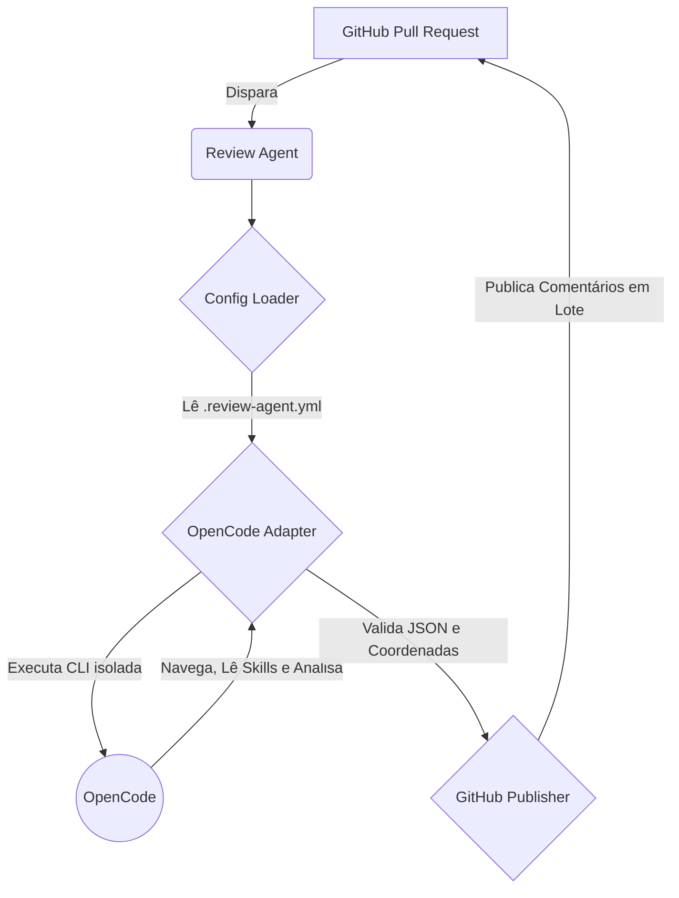

# Review Agent - Technical Overview

Bem-vindo ao **Review Agent**, a nossa Plataforma de Code Review Inteligente baseada em OpenCode. Este documento serve como um guia definitivo para novos desenvolvedores entenderem o que é o projeto, nossa arquitetura e as principais decisões técnicas que moldaram a aplicação.

---

## 🎯 O Que É o Review Agent?

O **Review Agent** é uma ferramenta de revisão automática de Pull Requests (PRs). Ele atua diretamente em pipelines de CI/CD (como GitHub Actions) analisando o código proposto e provendo feedback valioso (findings) de forma automatizada. 

O diferencial do Review Agent é a sua **filosofia de design**: ele **não** tenta analisar o código por si mesmo. Em vez disso, ele atua como um **orquestrador**, delegando toda a carga pesada de Inteligência Artificial e compreensão de código para o **OpenCode**, baseando-se nas "Skills" (diretrizes e regras de negócio) definidas no repositório.

---

## 🏗️ Arquitetura do Sistema

Nossa arquitetura foi desenhada para ser o mais simples e desacoplada possível, seguindo o princípio fundamental: **O OpenCode é o Revisor**.

### O Que Nós NÃO Construímos
Nós deliberadamente optamos por **não** implementar ferramentas complexas no Review Agent, tais como:
- *Diff Parsers*, *File Classifiers*, *Language Detectors*
- Motores de regras (Rule Engines)
- Analisadores de Segurança ou Arquitetura

**Motivo:** O OpenCode já possui todas essas capacidades nativamente. Reconstruí-las aumentaria absurdamente a complexidade, custo de manutenção e acoplamento.

### Nossa Arquitetura Simplificada



**Responsabilidades do Review Agent:**
1. Ler as configurações (`.review-agent.yml`).
2. Invocar o OpenCode com um prompt restritivo e controlado.
3. Extrair, formatar e validar a saída.
4. Publicar os resultados no GitHub.

**Responsabilidades do OpenCode:**
1. Navegar no projeto e analisar o Diff.
2. Ler as Skills (ex: `architecture/SKILL.md`, `security/SKILL.md`).
3. Compreender o contexto e gerar os *findings*.

---

## 🧠 Principais Decisões Técnicas (ADRs)

Para garantir resiliência em um ambiente automatizado de CI/CD, tomamos as seguintes decisões de engenharia:

### 1. Validação Híbrida de Coordenadas de Linha (Diff Coordinate Validator)
* **O Problema:** LLMs tendem a "alucinar" linhas de código. Se tentarmos postar um comentário inline em uma linha que não foi modificada no PR, a API do GitHub retorna erro `HTTP 422` e aborta todo o workflow.
* **A Solução:** O Review Agent carrega o diff do PR em memória (via `git diff` local ou API do GitHub como fallback) logo na inicialização. Antes de publicar, verificamos em tempo constante $O(1)$ se a coordenada (`file` e `line`) sugerida pelo modelo realmente pertence aos hunks modificados. Findings com linhas inválidas são mantidos apenas no resumo geral, protegendo o pipeline.

### 2. Cálculo Consistente de Estatísticas no Cliente
* **O Problema:** LLMs são ruins em matemática. Elas podem gerar 5 findings "críticos", mas no sumário afirmar que encontraram apenas 2.
* **A Solução:** Ignoramos os sumários gerados pela IA. O Review Agent faz a contagem agregada de severidades (critical, high, medium, etc.) localmente com base no payload extraído. Isso garante 100% de precisão nos relatórios.

### 3. Extração de JSON Resiliente (Brace-Matching)
* **O Problema:** Modelos de linguagem frequentemente inserem textos antes ou depois do JSON (ex: "Aqui está o resultado:", ou blocos de markdown ```json ... ```). 
* **A Solução:** Não dependemos de Regex ou recortes estáticos. Implementamos um algoritmo de extração determinístico por balanceamento de chaves (`{}`) para encontrar a raiz do JSON que contém a propriedade `"findings"`, ignorando todo o texto periférico.

### 4. Transações Únicas e Otimizadas (Lote)
* **O Problema:** Fazer uma chamada na API do GitHub para cada linha comentada esgota rapidamente os *Rate Limits* e enche o desenvolvedor de notificações.
* **A Solução:** Agrupamos o sumário geral em Markdown e todos os comentários inline em uma única transação utilizando a chamada `pulls.createReview`. Isso cria uma experiência fluida de revisão (similar a ferramentas consagradas como o CodeRabbit).

### 5. Isolamento de Stdin e Sandbox Temporário
* **O Problema:** A CLI do OpenCode, quando executada em ambientes de CI/CD (sem TTY), pode travar a pipeline aguardando interações do usuário. Além disso, o OpenCode poderia tentar alterar arquivos no código inadvertidamente.
* **A Solução:** Invocamos o OpenCode via `execa` com `stdin: 'ignore'`. Mais do que isso: o Review Agent escreve um arquivo de configuração temporário que desativa a capacidade do OpenCode de escrever/editar arquivos e auto-aprova a execução (bypass interativo), garantindo uma execução segura (sandbox) e sem travamentos.

### 6. Tolerância a Nulidade em Campos Opcionais (Zod Nullish Schema)
* **O Problema:** Modelos (como o Gemini Flash) costumam colocar o valor nulo (`"suggestion": null`) em propriedades opcionais em vez de omitir a chave no JSON, o que causaria um erro fatal de validação TypeScript estrita.
* **A Solução:** Configuramos nossos Schemas de validação Zod para aceitar explicitamente campos nulos com um fallback transformador, mapeando perfeitamente a inconsistência da IA para o nosso domínio limpo (`undefined`).

---

## 🚀 O Fluxo de Vida de um PR

1. **Trigger:** Um PR é aberto. A GitHub Action clona o repositório e inicia o container Docker do Review Agent.
2. **Configuração:** Lemos o `.review-agent.yml` local do desenvolvedor e pré-carregamos em memória as linhas modificadas (Diff Validator).
3. **Delegação:** Acionamos a CLI do OpenCode com um prompt determinístico de retorno JSON estruturado.
4. **Análise de IA:** O OpenCode entra em ação, navega no código, consulta as `.opencode/skills/` e entende as violações.
5. **Parseamento:** Extraímos e validamos (Zod) as violações encontradas pela IA.
6. **Publicação:** Filtramos e enviamos a revisão consolidada para o GitHub API via `pulls.createReview`.

---

## 📚 Como Colaborar

* **Repositório e Código:** Todo o core da orquestração está em `src/`. As lógicas principais de extração de contexto estão divididas em sub-domínios claros: `core/`, `github/`, `opencode/`, `parsers/`.
* **Rodando Local:** Você pode testar e validar o agente rodando scripts como `npm run dev` (`tsx src/cli/index.ts`) contra diffs em projetos locais (veja o `run-local.sh`).

A filosofia deve ser sempre mantida: **se envolver análise, entenda como fazer o OpenCode resolver isso usando uma Skill**. O código do Review Agent deve se manter focado em ser rápido, imune a quebras de formato e um bom cidadão com a API do GitHub.
